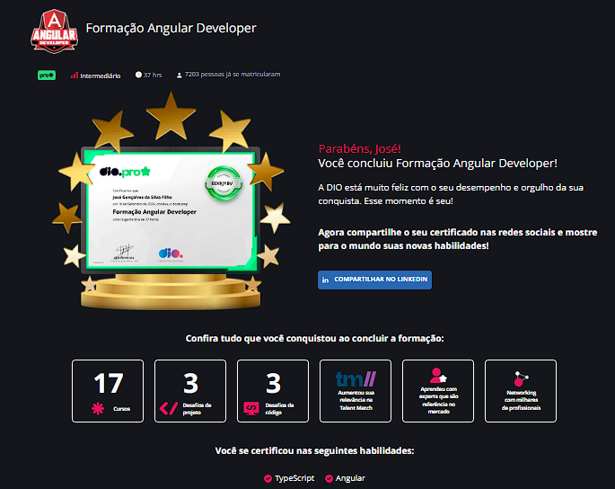
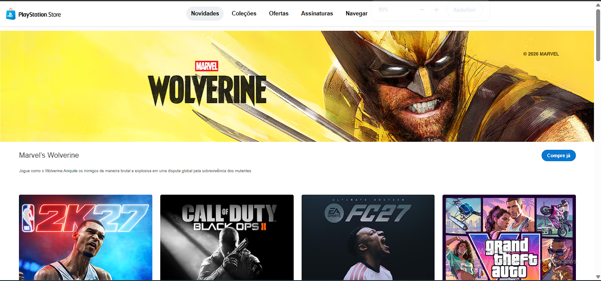

# PlayStation Store Clone

Projeto desenvolvido para fins exclusivamente educacionais como etapa de conclusão da trilha de aprendizagem **Triângulo**, realizada por meio da plataforma [Digital Innovation One (DIO)](https://www.dio.me/).



A aplicação reproduz, de forma autoral e simplificada, a experiência visual de uma loja digital de jogos inspirada em padrões de interfaces da PlayStation Store. O objetivo foi praticar Angular, organização de componentes, estilização responsiva e construção de uma página composta por seções reutilizáveis.

> Este projeto não possui vínculo oficial com a Sony Interactive Entertainment ou com a PlayStation. Marcas, nomes e referências visuais pertencem aos seus respectivos proprietários e foram utilizados apenas como referência de estudo.

## Objetivos do projeto

- Consolidar os conhecimentos adquiridos durante a trilha Triângulo da DIO.
- Praticar a criação de interfaces com Angular.
- Dividir a página em componentes independentes e reutilizáveis.
- Trabalhar com propriedades de componentes para exibir banners, cards e listas de imagens.
- Aplicar CSS responsivo para diferentes tamanhos de tela.
- Reutilizar padrões comuns em sites de comércio digital, como cabeçalho, banner promocional, vitrines, categorias e rodapé institucional.
- Finalizar a trilha com um projeto visual que pudesse ser publicado e apresentado como resultado da aprendizagem.

## Demonstração da ideia

A página foi pensada como uma landing page de uma loja de jogos, com uma sequência de blocos visuais:

1. Cabeçalho com navegação principal.
2. Banner de destaque para divulgação de um produto ou lançamento.
3. Vitrine de jogos em destaque.
4. Lista de produtos ou categorias relevantes.
5. Banner promocional do PlayStation Plus.
6. Seção **Veja mais**, com categorias como PS5, PS4, jogos melhorados, expansões, jogos gratuitos e PS VR2.
7. Rodapé com informações institucionais, país/região e links de referência.

A estrutura prioriza a reutilização de componentes: o mesmo componente de banner pode receber diferentes textos e imagens, enquanto componentes de lista recebem arrays de caminhos de imagens para renderizar os cards.

## Arquitetura

O projeto utiliza a arquitetura baseada em componentes do Angular. Cada parte visual da página possui responsabilidades próprias, facilitando manutenção, leitura e evolução do código.

```text
ps_store/
├── public/
│   ├── assets/
│   │   ├── banner-walverine.png
│   │   ├── banner-psn_plus.png
│   │   ├── destaque/
│   │   ├── list-great/
│   │   └── options/
│   └── playstation-favicon.svg
├── src/
│   ├── app/
│   │   ├── components/
│   │   │   ├── banner/
│   │   │   ├── destaque/
│   │   │   ├── footer/
│   │   │   ├── header/
│   │   │   ├── list-great/
│   │   │   └── options/
│   │   ├── app.html
│   │   ├── app.ts
│   │   └── app.css
│   ├── index.html
│   ├── main.ts
│   ├── main.server.ts
│   ├── server.ts
│   └── styles.css
├── angular.json
├── package.json
└── tsconfig*.json
```

### Componentes principais

- **App**: componente raiz que organiza a composição das seções e fornece as listas de imagens.
- **Header**: representa a navegação superior da loja.
- **Banner**: componente reutilizável para chamadas promocionais, recebendo título, descrição, imagem e classe alternativa.
- **Destaque**: renderiza uma grade de cards a partir da propriedade `listItem`.
- **ListGreat**: concentra uma seção adicional de produtos ou conteúdos em destaque.
- **Options**: apresenta categorias complementares da loja usando o componente de destaque.
- **Footer**: reúne navegação institucional, seleção de país/região, identificação do projeto e links do autor.

## Tecnologias e versões

As versões abaixo são as declaradas no `package.json` do projeto:

| Tecnologia | Versão declarada |
|---|---:|
| Angular | `22.0.x` |
| Angular CLI | `22.0.7` |
| Angular SSR | `22.0.7` |
| TypeScript | `~6.0.2` |
| Node types | `^20.17.19` |
| RxJS | `~7.8.0` |
| Express | `^5.1.0` |
| Vitest | `^4.0.8` |
| Prettier | `^3.8.1` |
| npm | `12.0.1` via `packageManager` |

Também foram utilizados HTML, CSS, SVG e imagens PNG para compor a interface. O projeto utiliza o builder de aplicação do Angular e possui configuração para renderização no servidor (SSR).

## Como foi pensado

A criação foi guiada por três ideias principais:

### 1. Reutilização

Elementos recorrentes em lojas digitais foram transformados em componentes independentes. Assim, banners, vitrines e cards podem ser reaproveitados em mais de uma seção sem duplicar a estrutura HTML.

### 2. Dados separados da apresentação

As imagens dos jogos e categorias são organizadas em arrays no TypeScript e enviadas aos componentes por meio de `@Input()`. Dessa maneira, é possível trocar ou adicionar itens sem alterar o template de cada card.

### 3. Aproximação de uma interface real

A composição foi inspirada em referências públicas de lojas digitais, especialmente na organização visual da PlayStation Store: navegação, banners de campanhas, vitrines horizontais ou em grade, categorias de produtos e rodapé institucional. A implementação, porém, foi feita como exercício autoral e não reproduz funcionalidades comerciais reais, como login, carrinho, pagamentos ou integração com APIs.

## Pré-requisitos

- Node.js compatível com Angular 22.
- npm instalado.
- Git, caso queira clonar o repositório.

## Instalação

Clone o repositório e acesse a pasta do projeto:

```bash
git clone https://github.com/JoseGoncalvess
cd ps_store
```

Instale as dependências:

```bash
npm install
```

## Executando localmente

Inicie o servidor de desenvolvimento:

```bash
npm start
```

Depois, acesse `http://localhost:4200/` no navegador. A aplicação será recarregada automaticamente durante as alterações.

## Build de produção

Para gerar os artefatos de produção:

```bash
npm run build
```

A saída é criada na pasta `dist/`. A configuração atual também gera os bundles necessários para SSR.

Para executar o servidor SSR após o build:

```bash
npm run serve:ssr:ps_store
```

## Testes

O projeto possui configuração de testes com Vitest por meio do Angular CLI:

```bash
npm test
```

## Resultado da trilha

Este projeto representa o ponto de conclusão da trilha de aprendizagem e foi criado para demonstrar a aplicação prática dos conteúdos estudados. O foco principal foi transformar conceitos de Angular, componentes e estilização em uma interface funcional, organizada e visualmente consistente.



## Referências de estudo

Parte dos conteúdos, conceitos e exemplos utilizados como apoio durante o desenvolvimento pode ser consultada no repositório [angular-playground](https://github.com/felipeAguiarCode/angular-playground), de [Felipe Aguiar](https://github.com/felipeAguiarCode).

O repositório reúne exemplos práticos e materiais relacionados ao Angular. Alguns exemplos foram desenvolvidos com uma versão mais antiga do framework, mas os conceitos fundamentais continuam aplicáveis às versões atuais, como componentes, templates, bindings, diretivas, organização de projetos e reutilização de código. Quando necessário, a implementação deste projeto foi adaptada à estrutura e à sintaxe do Angular 22.

Essa referência foi utilizada como material complementar de aprendizagem, sem copiar a identidade visual ou o conteúdo específico do projeto original.

## Autor

Desenvolvido para fins de estudo por **Goncalvess**.

- GitHub: [github.com/JoseGoncalvess](https://github.com/JoseGoncalvess)
- LinkedIn: [linkedin.com/in/jgoncalvessf](https://www.linkedin.com/in/jgoncalvessf)

---

Desenvolvido a título de estudo da tecnologia Angular por Goncalvess.
